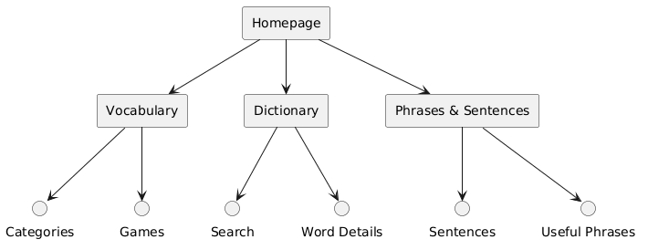
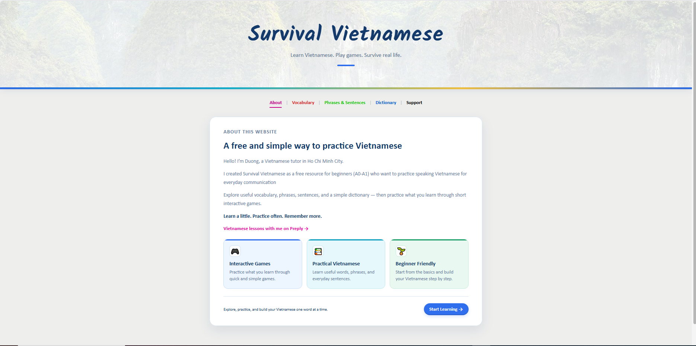
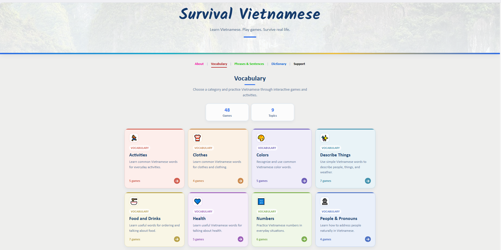
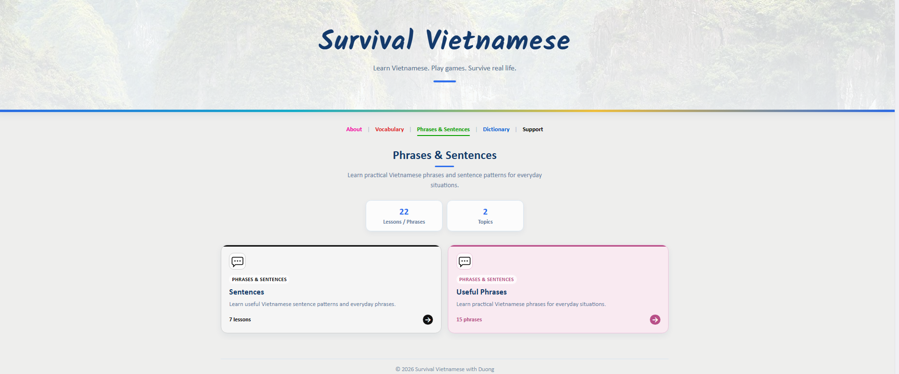
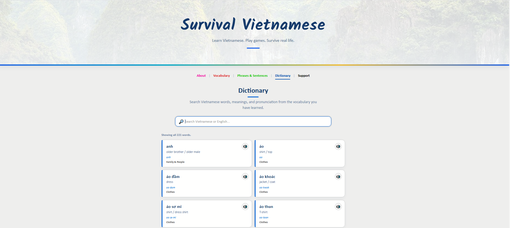
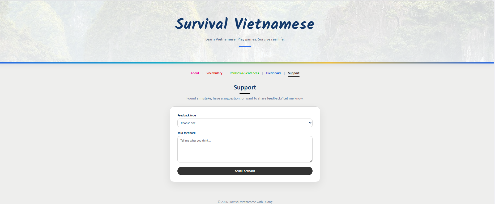

# Survival Vietnamese with Duong

## 🎯 Purpose

**Survival Vietnamese with Duong** is a website designed to help beginners learn practical Vietnamese through vocabulary, everyday phrases, sentence patterns, and interactive games.

The website focuses on **simple, practical Vietnamese for everyday communication**.

## 🛠️ Technologies Used

* **HTML** – website structure
* **CSS** – styling and layout
* **JavaScript** – functionality and interactions
* **JSON** – vocabulary and category data
* **Supabase** – backend and analytics
* **MP3 Audio** – Vietnamese pronunciation
* **PlantUML** – website structure diagram

## 📁 Website Structure

The website is divided into four main sections:

* **Homepage** – main landing page
* **Vocabulary** – vocabulary organized by topic with interactive games
* **Dictionary** – search for Vietnamese words, pronunciation, meanings, and audio
* **Phrases & Sentences** – practice useful phrases and basic sentence patterns

Additional resources include pronunciation audio files and backend services for analytics.

## 👥 Target Audience

The website is designed for:

* **A0–A1 Vietnamese learners**
* Vietnamese heritage learners
* Beginners who want to learn everyday Vietnamese
* Learners looking for a **free and simple** Vietnamese learning resource

## 🌐 Website Structure Diagram

 

